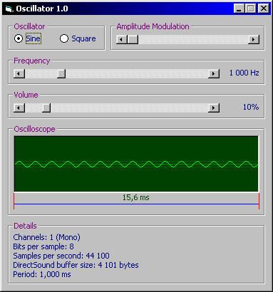



## Oscillator \(DirectSound\)

### Description

Generator of sine and square signal through DirectSound + Oscilloscope. Amplitude and frequency (1 to 22050 Hz) modifier + amplitude modulator included.
 
### More Info
 

             |
---                |---
**Submitted On**   |2002-09-20 11:42:04
**By**             |[Petr Supina](https://github.com/Planet-Source-Code/PSCIndex/blob/master/ByAuthor/petr-supina.md)
**Level**          |Beginner
**User Rating**    |5.0 (189 globes from 38 users)
**Compatibility**  |VB 6\.0
**Category**       |[Sound/MP3](https://github.com/Planet-Source-Code/PSCIndex/blob/master/ByCategory/sound-mp3__1-45.md)
**World**          |[Visual Basic](https://github.com/Planet-Source-Code/PSCIndex/blob/master/ByWorld/visual-basic.md)
**Archive File**   |[Oscillator1379459292002\.zip](https://github.com/Planet-Source-Code/petr-supina-oscillator-directsound__1-39362/archive/master.zip)

